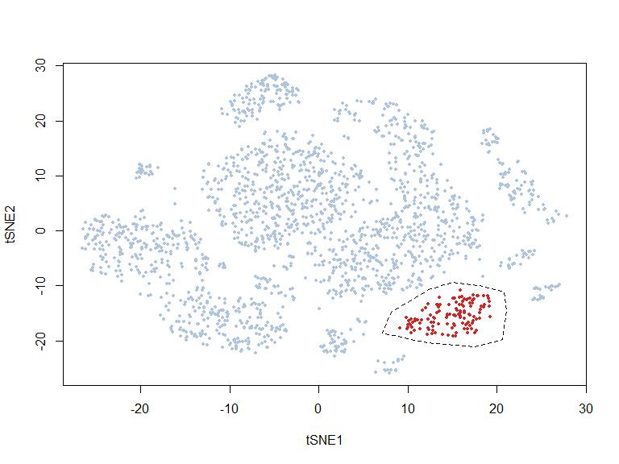
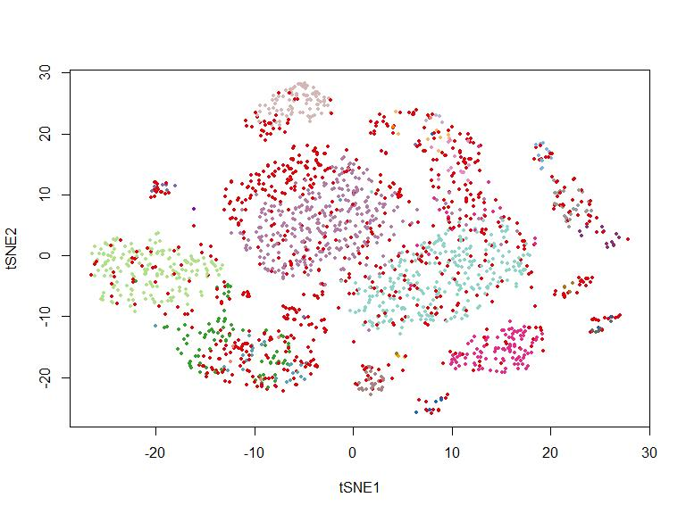
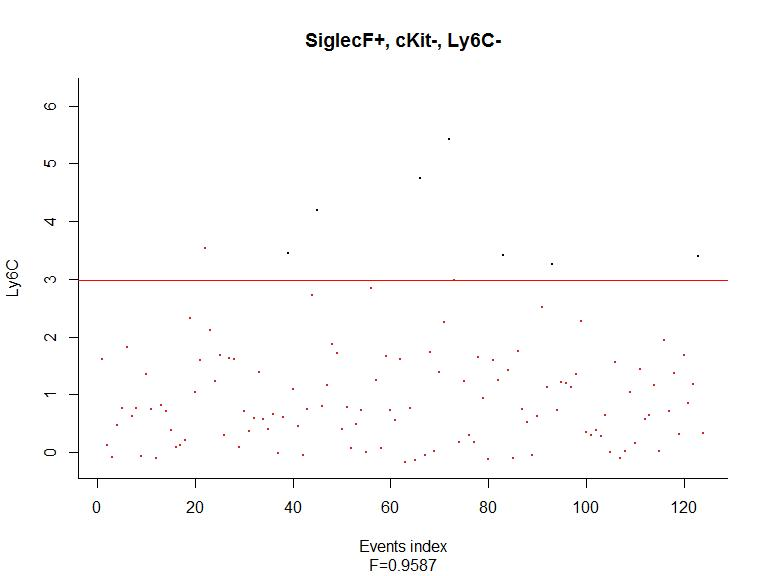
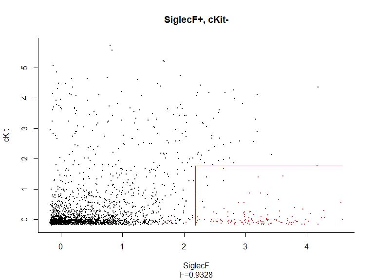
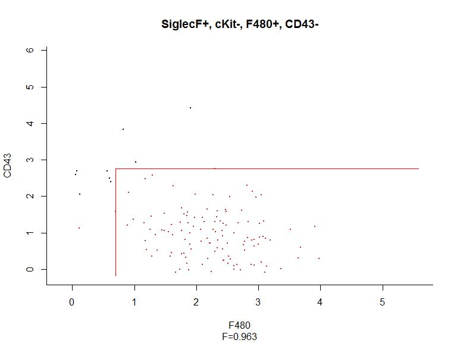
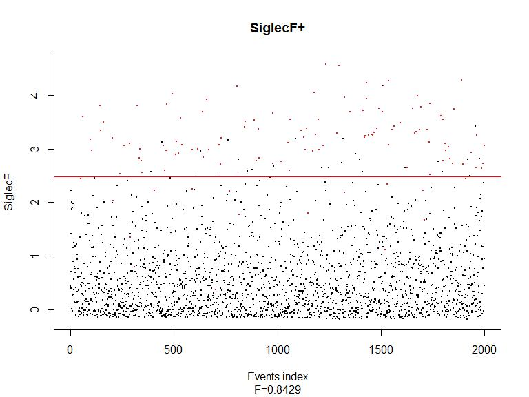

Hypergate and C5.0
================
S. Granjeaud - CRCM
21 August 2018

-   [Releases](#releases)
-   [Introduction](#introduction)
-   [Hypergate example](#hypergate-example)
-   [Reducing markers](#reducing-markers)
-   [Expand the number of populations](#expand-the-number-of-populations)

#### Releases

| Version  | Changes                        |
|----------|:-------------------------------|
| 18/08/21 | hypergate and C5.0 1st release |

| TODO | Comment                                                      |
|------|:-------------------------------------------------------------|
|      | apply hypergate to mulitiple populations and compare to C5.0 |

Introduction
------------

Hypergate is a package that aims to characterize and find a signature of a selected set of events. The result could be interpreted as signature or a gating strategy. Hypergate is available at .

C5.0 is a decision tree algorithm that aims to find splits on original axes that allow to separate multiple groups of data points.

Let's compare their results.

Before add some helper functions.

``` r
#' @title hgate_info
#' @description Extract information about a hypergate return: the channels of the phenotype, the sign of the channels, the sign of the comparison, the thresholds.
#' @param gate A hypergate object (produced by hypergate())
#' @return A data.frame with channel, sign, comp and threshold columns
#' @seealso \code{\link{hg_pheno}}, \code{\link{hg_rule}}
#' @examples
#' data(Samusik_01_subset)
#' xp=Samusik_01_subset$xp_src[,Samusik_01_subset$regular_channels]
#' gate_vector=Samusik_01_subset$labels
#' hg=hypergate(xp=xp,gate_vector=gate_vector,level=23,delta_add=0.01)
#' hgate_info(gate=hg)
#' hgate_pheno(gate=hg)
#' hgate_rule(gate=hg)
#' @export

hgate_info <- function(gate) {
  # retrieve threshold
  pars = gate$pars.history
  active_pars = gate$active_channels
  pars = pars[, active_pars, drop = FALSE]
  pars_order = apply(pars, 2, function(x) min(which(x != x[1])))
  pars = pars[, order(pars_order, decreasing = FALSE), drop = FALSE]
  pars = setNames(pars[nrow(pars), , drop = TRUE], colnames(pars))
  # get channel names
  channels = sub("_max", "", names(pars))
  channels = sub("_min", "", channels)
  # phenotype sign
  dir.sign = rep('+', length(pars))
  dir.sign[grep("_max", names(pars))] = '-'
  # comparison sign
  dir.comp = rep(' > ', length(pars))
  dir.comp[grep("_max", names(pars))] = ' <= '
# all together
  data.frame(
    channels, sign = dir.sign, comp = dir.comp, threshold = pars
  )
}

#' @title hgate_pheno
#' @description Build a human readable phenotype, i.e. a combination of channels and sign (+ or -) from a hypergate return.
#' @param gate A hypergate object (produced by hypergate())
#' @return A string representing the phenotype.
#' @seealso \code{\link{hg_rule}}, \code{\link{hg_info}}
#' @examples
#' ## See hgate_info
#' @export

hgate_pheno <- function(gate, collapse = ", ") {
  with(hgate_info(gate), paste0(channels, sign, collapse = collapse))
}

#' @title hgate_info
#' @description Extract information about a hypergate return: the channels of the phenotype, the sign of the channels, the sign of the comparison, the thresholds.
#' @param gate A hypergate object (produced by hypergate())
#' @return A data.frame with channel, sign, comp and threshold columns
#' @seealso \code{\link{hg_pheno}}, \code{\link{hg_rule}}
#' @examples
#' ## See hgate_info
#' @export

hgate_rule <- function(gate, collapse = ", ", digits = 2) {
  with(hgate_info(gate), paste0(channels, comp, round(threshold, digits), collapse = collapse))
}
```

Hypergate example
-----------------

### Rerun hypergate

``` r
library(hypergate)

# Example data overview
data(Samusik_01_subset,package="hypergate")
head(Samusik_01_subset$labels, 10)
```

    ##  20  28  70 110 120 159 215 226 249 251 
    ##  13  -1  -1  -1  15  -1  -1  17  15  15

``` r
head(Samusik_01_subset$regular_channels, 10)
```

    ##  [1] "IgD"   "CD11c" "F480"  "CD3"   "NKp46" "CD23"  "CD34"  "CD115"
    ##  [9] "CD19"  "120g8"

``` r
head(Samusik_01_subset$xp_src[,"label"], 10)
```

    ##  20  28  70 110 120 159 215 226 249 251 
    ##  13 NaN NaN NaN  15 NaN NaN  17  15  15

``` r
# Select a group of events
x = c(12.54, 8.08, 7.12, 12.12, 17.32, 20.62, 21.04, 20.83, 18.07, 15.2)
y = c(-10.61, -14.76, -18.55, -20.33, -21.16, -19.74, -14.4, -11.08, -10.02, -9.42)
pol = list(x = x, y = y)
gate_vector = sp::point.in.polygon(Samusik_01_subset$tsne[, 1], 
                                   Samusik_01_subset$tsne[, 2], pol$x, pol$y)
plot(Samusik_01_subset$tsne, pch = 16, cex = 0.5, 
     col = ifelse(gate_vector == 1, "firebrick3", "lightsteelblue"))
polygon(pol, lty = 2)
```



``` r
table(gate_vector)
```

    ## gate_vector
    ##    0    1 
    ## 1874  126

``` r
# Define cluster colors (here there are 30 colors) from Nowicka et al F1000
color_clusters <- c("#DC050C", "#FB8072", "#1965B0", "#7BAFDE", "#882E72",
  "#B17BA6", "#FF7F00", "#FDB462", "#E7298A", "#E78AC3",
  "#33A02C", "#B2DF8A", "#55A1B1", "#8DD3C7", "#A6761D",
  "#E6AB02", "#7570B3", "#BEAED4", "#666666", "#999999",
  "#aa8282", "#d4b7b7", "#8600bf", "#ba5ce3", "#808000",
  "#aeae5c", "#1e90ff", "#00bfff", "#56ff0d", "#ffff00")

plot(Samusik_01_subset$tsne, pch = 16, cex = 0.5, 
     col = color_clusters[as.factor(Samusik_01_subset$labels)])
```



``` r
# Compute hypergate
hg_output = hypergate(xp = Samusik_01_subset$xp_src[, Samusik_01_subset$regular_channels], gate_vector = gate_vector, level = 1, verbose = FALSE)
# hg_output

plot_gating_strategy(gate = hg_output, xp = Samusik_01_subset$xp_src[, 
    Samusik_01_subset$regular_channels], gate_vector = gate_vector, 
    level = 1, highlight = "firebrick3")
```

    ## Warning in plot_gating_strategy(gate = hg_output, xp = Samusik_01_subset
    ## $xp_src[, : path argument is missing, output won't be saved to file



``` r
hgate_info(hg_output)
```

    ##             channels sign comp threshold
    ## SiglecF_min  SiglecF    +   >   2.208221
    ## cKit_max        cKit    -  <=   1.770901
    ## Ly6C_max        Ly6C    -  <=   2.983523

``` r
# Characterize the markers that target the group
gating_predicted = subset_matrix_hg(hg_output,
  Samusik_01_subset$xp_src[, Samusik_01_subset$regular_channels])
table(ifelse(gating_predicted, "Gated-in", "Gated-out"),
      ifelse(gate_vector == 1, "Events of interest", "Others"))
```

    ##            
    ##             Events of interest Others
    ##   Gated-in                 116      0
    ##   Gated-out                 10   1874

``` r
#
bm = boolmat(gate = hg_output,
  xp = Samusik_01_subset$xp_src[, Samusik_01_subset$regular_channels])
head(bm)
```

    ##     SiglecF_min cKit_max Ly6C_max
    ## 20        FALSE     TRUE     TRUE
    ## 28        FALSE     TRUE     TRUE
    ## 70        FALSE    FALSE     TRUE
    ## 110        TRUE    FALSE    FALSE
    ## 120       FALSE     TRUE    FALSE
    ## 159       FALSE     TRUE    FALSE

### C5.0 alternative

The typical model is below.

``` r
library(C50)
model <- C5.0(Samusik_01_subset$xp_src[,Samusik_01_subset$regular_channels], as.factor(gate_vector))
summary(model)
```

    ## 
    ## Call:
    ## C5.0.default(x =
    ##  Samusik_01_subset$xp_src[, Samusik_01_subset$regular_channels], y
    ##  = as.factor(gate_vector))
    ## 
    ## 
    ## C5.0 [Release 2.07 GPL Edition]      Thu Aug 23 11:15:25 2018
    ## -------------------------------
    ## 
    ## Class specified by attribute `outcome'
    ## 
    ## Read 2000 cases (37 attributes) from undefined.data
    ## 
    ## Decision tree:
    ## 
    ## SiglecF <= 2.152557: 0 (1834/8)
    ## SiglecF > 2.152557:
    ## :...cKit > 1.794831: 0 (39)
    ##     cKit <= 1.794831:
    ##     :...Ly6C <= 2.884321: 1 (116)
    ##         Ly6C > 2.884321: 0 (11/2)
    ## 
    ## 
    ## Evaluation on training data (2000 cases):
    ## 
    ##      Decision Tree   
    ##    ----------------  
    ##    Size      Errors  
    ## 
    ##       4   10( 0.5%)   <<
    ## 
    ## 
    ##     (a)   (b)    <-classified as
    ##    ----  ----
    ##    1874          (a): class 0
    ##      10   116    (b): class 1
    ## 
    ## 
    ##  Attribute usage:
    ## 
    ##  100.00% SiglecF
    ##    8.30% cKit
    ##    6.35% Ly6C
    ## 
    ## 
    ## Time: 0.1 secs

C5.0 reports the same markers and order similarly. The importance of each marker is not the same as hypergate, but the message is the same. Out of 126 events selected on the tsne plot, 116 are correctly identified by the last rule, but 10 are missed.

We can also focuss on rules that gives an easier interpretation.

``` r
model <- C5.0(Samusik_01_subset$xp_src[,Samusik_01_subset$regular_channels], as.factor(gate_vector), rules = TRUE)
summary(model)
```

    ## 
    ## Call:
    ## C5.0.default(x =
    ##  Samusik_01_subset$xp_src[, Samusik_01_subset$regular_channels], y
    ##  = as.factor(gate_vector), rules = TRUE)
    ## 
    ## 
    ## C5.0 [Release 2.07 GPL Edition]      Thu Aug 23 11:15:25 2018
    ## -------------------------------
    ## 
    ## Class specified by attribute `outcome'
    ## 
    ## Read 2000 cases (37 attributes) from undefined.data
    ## 
    ## Rules:
    ## 
    ## Rule 1: (784/2, lift 1.1)
    ##  Ly6C > 2.884321
    ##  ->  class 0  [0.996]
    ## 
    ## Rule 2: (1834/8, lift 1.1)
    ##  SiglecF <= 2.152557
    ##  ->  class 0  [0.995]
    ## 
    ## Rule 3: (174, lift 1.1)
    ##  cKit > 1.794831
    ##  ->  class 0  [0.994]
    ## 
    ## Rule 4: (116, lift 15.7)
    ##  Ly6C <= 2.884321
    ##  SiglecF > 2.152557
    ##  cKit <= 1.794831
    ##  ->  class 1  [0.992]
    ## 
    ## Default class: 0
    ## 
    ## 
    ## Evaluation on training data (2000 cases):
    ## 
    ##          Rules     
    ##    ----------------
    ##      No      Errors
    ## 
    ##       4   10( 0.5%)   <<
    ## 
    ## 
    ##     (a)   (b)    <-classified as
    ##    ----  ----
    ##    1874          (a): class 0
    ##      10   116    (b): class 1
    ## 
    ## 
    ##  Attribute usage:
    ## 
    ##   97.50% SiglecF
    ##   45.00% Ly6C
    ##   14.50% cKit
    ## 
    ## 
    ## Time: 0.1 secs

Same summary, but result consists in rules.

Let's see the last one.

``` r
# Rule 4: (116, lift 15.7)
#   Ly6C <= 2.884321
#   SiglecF > 2.152557
#   cKit <= 1.794831
#   ->  class 1  [0.992]
in.rule = rep(TRUE, length(gate_vector))
in.rule = in.rule & Samusik_01_subset$xp_src[,"Ly6C"] <= 2.884321
in.rule = in.rule & Samusik_01_subset$xp_src[,"SiglecF"] > 2.152557
in.rule = in.rule & Samusik_01_subset$xp_src[,"cKit"]  <= 1.794831
table(in.rule, gate_vector)
```

    ##        gate_vector
    ## in.rule    0    1
    ##   FALSE 1874   10
    ##   TRUE     0  116

``` r
# Columns are the truth, the groups we defined 
# Rows are the prediction the groups the algorithm defined
# The last rule retains 116 events, 116 belong to the group, 0 are out of the
# group, but 10 events of the group are missing
```

Reducing markers
----------------

### Reoptimize strategy, without Ly6C

The proposed optimization without Ly6C in the signature.

``` r
hg_output_polished = reoptimize_strategy(gate = hg_output, channels_subset = c("SiglecF_min", "cKit_max"), xp = Samusik_01_subset$xp_src[, Samusik_01_subset$regular_channels], gate_vector = gate_vector, level = 1)

gating_predicted_polished = subset_matrix_hg(hg_output_polished,
  Samusik_01_subset$xp_src[, Samusik_01_subset$regular_channels])
table(ifelse(gating_predicted_polished, "Gated-in", "Gated-out"),
      ifelse(gate_vector == 1, "Events of interest", "Others"))
```

    ##            
    ##             Events of interest Others
    ##   Gated-in                 117      7
    ##   Gated-out                  9   1867

``` r
plot_gating_strategy(gate = hg_output_polished, xp = Samusik_01_subset$xp_src[, 
    Samusik_01_subset$regular_channels], gate_vector = gate_vector, 
    level = 1, highlight = "firebrick3")
```

    ## Warning in plot_gating_strategy(gate = hg_output_polished, xp =
    ## Samusik_01_subset$xp_src[, : path argument is missing, output won't be
    ## saved to file

    ## Warning in min(which(x != x[1])): no non-missing arguments to min;
    ## returning Inf

    ## Warning in min(which(x != x[1])): no non-missing arguments to min;
    ## returning Inf


``` r
hgate_info(hg_output_polished)
```

    ## Warning in min(which(x != x[1])): no non-missing arguments to min;
    ## returning Inf

    ## Warning in min(which(x != x[1])): no non-missing arguments to min;
    ## returning Inf

    ##             channels sign comp threshold
    ## SiglecF_min  SiglecF    +   >   2.208221
    ## cKit_max        cKit    -  <=   1.770901

Let's see if we remove the Ly6C marker from the signature.

``` r
hg_output1 = hypergate(xp = Samusik_01_subset$xp_src[,setdiff(Samusik_01_subset$regular_channels, c("Ly6C"))], gate_vector = gate_vector, level = 1, verbose = FALSE)
gating_predicted1 = subset_matrix_hg(hg_output1,
  Samusik_01_subset$xp_src[, setdiff(Samusik_01_subset$regular_channels, c("Ly6C"))])
table(ifelse(gating_predicted, "Gated-in", "Gated-out"),
      ifelse(gate_vector == 1, "Events of interest", "Others"))
```

    ##            
    ##             Events of interest Others
    ##   Gated-in                 116      0
    ##   Gated-out                 10   1874

``` r
plot_gating_strategy(gate = hg_output1, xp = Samusik_01_subset$xp_src[, 
    Samusik_01_subset$regular_channels], gate_vector = gate_vector, 
    level = 1, highlight = "firebrick3")
```

    ## Warning in plot_gating_strategy(gate = hg_output1, xp = Samusik_01_subset
    ## $xp_src[, : path argument is missing, output won't be saved to file



``` r
hgate_info(hg_output1)
```

    ##             channels sign comp threshold
    ## SiglecF_min  SiglecF    +   >   2.182152
    ## cKit_max        cKit    -  <=   1.770901
    ## F480_min        F480    +   >   0.700829
    ## CD43_max        CD43    -  <=   2.765152

The result is nearly the same.

Let's see if we remove the SiglecF marker from the signature.

``` r
hg_output_polished2 = reoptimize_strategy(gate = hg_output, channels_subset = c("SiglecF_min"), xp = Samusik_01_subset$xp_src[, Samusik_01_subset$regular_channels], 
    gate_vector = gate_vector, level = 1)

plot_gating_strategy(gate = hg_output_polished2, xp = Samusik_01_subset$xp_src[, 
    Samusik_01_subset$regular_channels], gate_vector = gate_vector, 
    level = 1, highlight = "firebrick3")
```

    ## Warning in plot_gating_strategy(gate = hg_output_polished2, xp =
    ## Samusik_01_subset$xp_src[, : path argument is missing, output won't be
    ## saved to file



``` r
gating_predicted_polished2 = subset_matrix_hg(hg_output_polished2,
  Samusik_01_subset$xp_src[, Samusik_01_subset$regular_channels])
table(ifelse(gating_predicted_polished2, "Gated-in", "Gated-out"),
      ifelse(gate_vector == 1, "Events of interest", "Others"))
```

    ##            
    ##             Events of interest Others
    ##   Gated-in                 110     25
    ##   Gated-out                 16   1849

``` r
hgate_info(hg_output_polished2)
```

    ##             channels sign comp threshold
    ## SiglecF_min  SiglecF    +   >   2.478972

It still perform well using other markers.

### C5.0 alternative

Maybe we can prune the tree at a higher level, but let's remove a marker and redo computation.

Let's remove Ly6C from markers.

``` r
# without Ly6C
model_reoptimzed <- C5.0(Samusik_01_subset$xp_src[,setdiff(Samusik_01_subset$regular_channels, c("Ly6C"))], as.factor(gate_vector), rules = TRUE)
summary(model_reoptimzed)
```

    ## 
    ## Call:
    ## C5.0.default(x =
    ##  setdiff(Samusik_01_subset$regular_channels, c("Ly6C"))], y
    ##  = as.factor(gate_vector), rules = TRUE)
    ## 
    ## 
    ## C5.0 [Release 2.07 GPL Edition]      Thu Aug 23 11:15:27 2018
    ## -------------------------------
    ## 
    ## Class specified by attribute `outcome'
    ## 
    ## Read 2000 cases (36 attributes) from undefined.data
    ## 
    ## Rules:
    ## 
    ## Rule 1: (305, lift 1.1)
    ##  F480 <= 1.084815
    ##  CD43 > 2.243915
    ##  ->  class 0  [0.997]
    ## 
    ## Rule 2: (1834/8, lift 1.1)
    ##  SiglecF <= 2.152557
    ##  ->  class 0  [0.995]
    ## 
    ## Rule 3: (174, lift 1.1)
    ##  cKit > 1.794831
    ##  ->  class 0  [0.994]
    ## 
    ## Rule 4: (114/1, lift 15.6)
    ##  F480 > 1.084815
    ##  SiglecF > 2.152557
    ##  cKit <= 1.794831
    ##  ->  class 1  [0.983]
    ## 
    ## Rule 5: (114/1, lift 15.6)
    ##  SiglecF > 2.152557
    ##  cKit <= 1.794831
    ##  CD43 <= 2.243915
    ##  ->  class 1  [0.983]
    ## 
    ## Default class: 0
    ## 
    ## 
    ## Evaluation on training data (2000 cases):
    ## 
    ##          Rules     
    ##    ----------------
    ##      No      Errors
    ## 
    ##       5   10( 0.5%)   <<
    ## 
    ## 
    ##     (a)   (b)    <-classified as
    ##    ----  ----
    ##    1872     2    (a): class 0
    ##       8   118    (b): class 1
    ## 
    ## 
    ##  Attribute usage:
    ## 
    ##   97.70% SiglecF
    ##   20.95% F480
    ##   20.95% CD43
    ##   14.70% cKit
    ## 
    ## 
    ## Time: 0.1 secs

``` r
# Rule 4: (114/1, lift 15.6)
# F480 > 1.084815
# SiglecF > 2.152557
# cKit <= 1.794831
# ->  class 1  [0.983]
# While 13 events are missing, nearly all events are correctly identified
in.rule = rep(TRUE, length(gate_vector))
in.rule = in.rule & Samusik_01_subset$xp_src[,"F480"] > 1.084815
in.rule = in.rule & Samusik_01_subset$xp_src[,"SiglecF"] > 2.152557
in.rule = in.rule & Samusik_01_subset$xp_src[,"cKit"] <= 1.794831
table(in.rule, gate_vector)
```

    ##        gate_vector
    ## in.rule    0    1
    ##   FALSE 1873   13
    ##   TRUE     1  113

``` r
# Rule 5: (114/1, lift 15.6)
# SiglecF > 2.152557
# cKit <= 1.794831
# CD43 <= 2.243915
# ->  class 1  [0.983]
# same result with this slightly different rule
in.rule = rep(TRUE, length(gate_vector))
in.rule = in.rule & Samusik_01_subset$xp_src[,"SiglecF"] > 2.152557
in.rule = in.rule & Samusik_01_subset$xp_src[,"cKit"] <= 1.794831
in.rule = in.rule & Samusik_01_subset$xp_src[,"CD43"] <= 2.243915
table(in.rule, gate_vector)
```

    ##        gate_vector
    ## in.rule    0    1
    ##   FALSE 1873   13
    ##   TRUE     1  113

Let's remove SiglecF from markers.

``` r
# without SiglecF
model_reoptimzed2 <- C5.0(Samusik_01_subset$xp_src[,setdiff(Samusik_01_subset$regular_channels, c("SiglecF"))], as.factor(gate_vector), rules = TRUE)
summary(model_reoptimzed2)
```

    ## 
    ## Call:
    ## C5.0.default(x =
    ##  setdiff(Samusik_01_subset$regular_channels, c("SiglecF"))], y
    ##  = as.factor(gate_vector), rules = TRUE)
    ## 
    ## 
    ## C5.0 [Release 2.07 GPL Edition]      Thu Aug 23 11:15:28 2018
    ## -------------------------------
    ## 
    ## Class specified by attribute `outcome'
    ## 
    ## Read 2000 cases (36 attributes) from undefined.data
    ## 
    ## Rules:
    ## 
    ## Rule 1: (497, lift 1.1)
    ##  Ly6C <= 0.1357326
    ##  CD44 <= 3.698416
    ##  ->  class 0  [0.998]
    ## 
    ## Rule 2: (805/1, lift 1.1)
    ##  CD11b <= 2.185502
    ##  CD44 <= 3.698416
    ##  ->  class 0  [0.998]
    ## 
    ## Rule 3: (876/1, lift 1.1)
    ##  Ly6C > 1.869782
    ##  CD16_32 <= 4.324192
    ##  Foxp3 <= 0.6313683
    ##  ->  class 0  [0.998]
    ## 
    ## Rule 4: (757/1, lift 1.1)
    ##  Ly6C > 1.869782
    ##  Foxp3 <= 0.6313683
    ##  CD44 <= 4.633746
    ##  ->  class 0  [0.997]
    ## 
    ## Rule 5: (273, lift 1.1)
    ##  CD11b > 2.898656
    ##  CD43 > 2.478766
    ##  ->  class 0  [0.996]
    ## 
    ## Rule 6: (827/2, lift 1.1)
    ##  F480 <= 2.2438
    ##  Ly6C > 1.869782
    ##  CD150 <= 0.1762875
    ##  ->  class 0  [0.996]
    ## 
    ## Rule 7: (1537/6, lift 1.1)
    ##  F480 <= 1.157256
    ##  ->  class 0  [0.995]
    ## 
    ## Rule 8: (168, lift 1.1)
    ##  cKit > 1.819595
    ##  ->  class 0  [0.994]
    ## 
    ## Rule 9: (435/2, lift 1.1)
    ##  Foxp3 <= 0.07933632
    ##  Sca1 > 0.4350279
    ##  ->  class 0  [0.993]
    ## 
    ## Rule 10: (79, lift 15.7)
    ##  F480 > 1.157256
    ##  Ly6C <= 1.869782
    ##  Foxp3 > 0.07933632
    ##  cKit <= 1.819595
    ##  CD43 <= 2.478766
    ##  CD44 > 3.698416
    ##  ->  class 1  [0.988]
    ## 
    ## Rule 11: (79/1, lift 15.5)
    ##  F480 > 1.157256
    ##  Ly6C <= 1.869782
    ##  Sca1 <= 0.4350279
    ##  cKit <= 1.819595
    ##  CD43 <= 2.478766
    ##  CD44 > 3.698416
    ##  ->  class 1  [0.975]
    ## 
    ## Rule 12: (9, lift 14.4)
    ##  F480 > 1.157256
    ##  Ly6C > 0.1357326
    ##  Ly6C <= 1.869782
    ##  CD11b > 2.185502
    ##  CD43 <= 3.120862
    ##  CD44 <= 3.698416
    ##  ->  class 1  [0.909]
    ## 
    ## Rule 13: (30/4, lift 13.4)
    ##  F480 > 2.2438
    ##  Foxp3 > 0.6313683
    ##  ->  class 1  [0.844]
    ## 
    ## Rule 14: (17/4, lift 11.7)
    ##  F480 > 1.157256
    ##  Foxp3 > 0.6313683
    ##  CD150 > 0.1762875
    ##  ->  class 1  [0.737]
    ## 
    ## Default class: 0
    ## 
    ## 
    ## Evaluation on training data (2000 cases):
    ## 
    ##          Rules     
    ##    ----------------
    ##      No      Errors
    ## 
    ##      14   16( 0.8%)   <<
    ## 
    ## 
    ##     (a)   (b)    <-classified as
    ##    ----  ----
    ##    1872     2    (a): class 0
    ##      14   112    (b): class 1
    ## 
    ## 
    ##  Attribute usage:
    ## 
    ##   92.55% F480
    ##   80.85% Ly6C
    ##   78.80% CD44
    ##   64.85% Foxp3
    ##   54.35% CD11b
    ##   43.80% CD16_32
    ##   42.20% CD150
    ##   25.70% Sca1
    ##   19.00% CD43
    ##   13.30% cKit
    ## 
    ## 
    ## Time: 0.1 secs

``` r
# no simple rule
# Rule 10: (79, lift 15.7)
#   F480 > 1.157256
#   Ly6C <= 1.869782
#   Foxp3 > 0.07933632
#   cKit <= 1.819595
#   CD43 <= 2.478766
#   CD44 > 3.698416
#   ->  class 1  [0.988]
```

Expand the number of populations
--------------------------------

The graphical selection of hypergate corresponds mainly to pop 8, ie Eosinophils.

``` r
# Identify the targetted cluster among annotated events
table(gate_vector, Samusik_01_subset$labels)
```

    ##            
    ## gate_vector  -1   1   2   3   4   5   6   7   8  10  12  13  14  15  16
    ##           0 770   5   8  10  12 312   1   8  19  13  83 169  25 262   5
    ##           1  23   0   0   0   0   0   0   0 103   0   0   0   0   0   0
    ##            
    ## gate_vector  17  18  19  20  21  22  23  24
    ##           0   3  11   4   5  28  28  92   1
    ##           1   0   0   0   0   0   0   0   0

``` r
pops = c("B-cell Frac A-C (pro-B cells)", "Basophils", "CD4 T cells", "CD8 T cells", "Classical Monocytes", "CLP", "CMP", "Eosinophils", "gd T cells", "GMP", "HSC", "IgD- IgMpos B cells", "IgDpos IgMpos B cells", "IgM- IgD- B-cells", "Intermediate Monocytes", "Macrophages", "mDCs", "MEP", "MPP", "NK cells", "NKT cells", "Non-Classical Monocytes", "pDCs", "Plasma Cells")

# Check the amount of populations in the sample
table(Samusik_01_subset$labels)
```

    ## 
    ##  -1   1   2   3   4   5   6   7   8  10  12  13  14  15  16  17  18  19 
    ## 793   5   8  10  12 312   1   8 122  13  83 169  25 262   5   3  11   4 
    ##  20  21  22  23  24 
    ##   5  28  28  92   1

``` r
# Let select some of the clusters
gate_vector_multi = Samusik_01_subset$labels
gate_vector_multi[!Samusik_01_subset$labels %in% c(5, 8, 12, 13, 15, 23)] = 0
table(gate_vector_multi)
```

    ## gate_vector_multi
    ##   0   5   8  12  13  15  23 
    ## 960 312 122  83 169 262  92

### C5.0

Let's apply C5.0 to all those groups at once.

``` r
model <- C5.0(Samusik_01_subset$xp_src[,Samusik_01_subset$regular_channels], as.factor(gate_vector_multi), rules = TRUE, control = C5.0Control(winnow = TRUE, noGlobalPruning = TRUE))
C50_head_tail <- function(model, head = 20, tail = 30) {
  model_str <- strsplit(model$output, "\\n")[[1]]
  if (length(model_str) < head + tail) return(model_str)
  c(model_str[1:head], "", "...truncated result...", "", model_str[length(model_str)-(tail:1)])
}
C50_head_tail(model)
```

\[1\] ""
\[2\] "C5.0 \[Release 2.07 GPL Edition\] Aug 23 11:15:28 2018"
\[3\] "-------------------------------"
\[4\] ""
\[5\] "Class specified by attribute \`outcome'"
\[6\] ""
\[7\] "Read 2000 cases (37 attributes) from undefined.data"
\[8\] ""
\[9\] "25 attributes winnowed"
\[10\] "Estimated importance of remaining attributes:"
\[11\] ""
\[12\] " 66% CD43"
\[13\] " 59% CD11b"
\[14\] " 56% IgD"
\[15\] " 34% SiglecF"
\[16\] " 25% 120g8"
\[17\] " 24% Ly6C"
\[18\] " 14% B220"
\[19\] " 14% IgM"
\[20\] " 10% CD3"
\[21\] ""
\[22\] "...truncated result..."
\[23\] ""
\[24\] ""
\[25\] "31 69( 3.5%) &lt;&lt;"
\[26\] ""
\[27\] ""
\[28\] "(a) (b) (c) (d) (e) (f) (g) &lt;-classified as" \[29\] "---- ---- ---- ---- ---- ---- ----"
\[30\] "913 9 6 5 4 21 2 (a): class 0"
\[31\] "14 298 (b): class 5"
\[32\] "121 1 (c): class 8"
\[33\] "83 (d): class 12"
\[34\] "169 (e): class 13"
\[35\] "7 255 (f): class 15"
\[36\] "92 (g): class 23"
\[37\] ""
\[38\] ""
\[39\] "usage:"
\[40\] ""
\[41\] "100.00%120g8"
\[42\] "62.65%11b"
\[43\] "59.35%220"
\[44\] "57.35%43"
\[45\] "47.10%"
\[46\] "45.85%6C"
\[47\] "43.60%3"
\[48\] "33.10%"
\[49\] "14.25%4"
\[50\] "13.10%"
\[51\] "1.80%19"
\[52\] ""
\[53\] ""
C5.0 is performing very well.

Let's find best rules using F scores.

``` r
# get rules of the model
c50.rules = strsplit(model$rules, "\\n")[[1]]
# parse rules attributes
rules = c("conds,cover,TP,lift,class")
for (i in grep("conds", c50.rules)) {
  rules = c(rules, sub("conds=\"(\\d+)\" cover=\"(\\d+)\" ok=\"(\\d+)\" lift=\"([0-9.]+)\" class=\"(\\d+)\"", "\\1,\\2,\\3,\\4,\\5", c50.rules[i]))
}
rules = read.table(text=paste(rules, collapse = "\n"), sep = ",", header = TRUE)
targets = as.data.frame(table(gate_vector_multi))
colnames(targets) = c("class", "Count")
rules = merge(rules, targets)
rules = within(rules, {
  FP = cover - TP
  FN = Count - TP
  recall = TP/(TP + FN)
  purity = TP/(TP + FP)
  beta = 1
  Fscore = ifelse(is.nan(purity) | is.nan(recall), 0, 
                  (1 + beta^2) * (recall * purity)/(recall + beta^2 * purity))
  rm(beta)
})
head(rules)
```

    ##   class conds cover  TP    lift Count     Fscore    purity     recall  FN
    ## 1     0     3   517 517 2.07932   960 0.70006770 1.0000000 0.53854167 443
    ## 2     0     4   125 125 2.06693   960 0.23041475 1.0000000 0.13020833 835
    ## 3     0     3   105 105 2.06386   960 0.19718310 1.0000000 0.10937500 855
    ## 4     0     5   145 144 2.05499   960 0.26063348 0.9931034 0.15000000 816
    ## 5     0     2    10  10 1.90972   960 0.02061856 1.0000000 0.01041667 950
    ## 6     0     3     9   9 1.89394   960 0.01857585 1.0000000 0.00937500 951
    ##   FP
    ## 1  0
    ## 2  0
    ## 3  0
    ## 4  1
    ## 5  0
    ## 6  0

``` r
# find best rule for each class
rules.best.idx = sapply(unique(rules$class), function(cl) { c50.rules = rules[rules$class == cl, , drop = FALSE]; rownames(c50.rules[which.max(c50.rules$Fscore), , drop = FALSE])})
rules.best = rules[rules.best.idx,]
# Compare True Positive (TP) and Count (from manual annotation)
library(knitr)
kable(rules.best)
```

|     |  class|  conds|  cover|   TP|      lift|  Count|     Fscore|     purity|     recall|   FN|   FP|
|-----|------:|------:|------:|----:|---------:|------:|----------:|----------:|----------:|----:|----:|
| 1   |      0|      3|    517|  517|   2.07932|    960|  0.7000677|  1.0000000|  0.5385417|  443|    0|
| 11  |      5|      7|    200|  193|   6.15638|    312|  0.7539062|  0.9650000|  0.6185897|  119|    7|
| 17  |      8|      5|    108|  105|  15.79730|    122|  0.9130435|  0.9722222|  0.8606557|   17|    3|
| 20  |     12|      3|     75|   70|  22.21870|     83|  0.8860759|  0.9333333|  0.8433735|   13|    5|
| 22  |     13|      4|    146|  144|  11.59440|    169|  0.9142857|  0.9863014|  0.8520710|   25|    2|
| 28  |     15|      7|    262|  241|   6.99746|    262|  0.9198473|  0.9198473|  0.9198473|   21|   21|
| 30  |     23|      2|     87|   85|  21.00640|     92|  0.9497207|  0.9770115|  0.9239130|    7|    2|

Let's extract rule defintions.

``` r
# parse rules
rule.defs = c("rule,type,att,cut,result")
rule.id = 0
for (i in seq(c50.rules)) {
  if (substr(c50.rules[i], 1, 6) == "conds=") {
    rule.id = rule.id + 1
  }
  if (substr(c50.rules[i], 1, 5) == "type=") {
    rule.defs = c(rule.defs, paste0(c(rule.id, sub("type=\"(\\d+)\" att=\"(.+)\" cut=\"([0-9.-]+)\" result=\"([<>])\"", "\\1,\\2,\\3,\\4", c50.rules[i])), collapse = ","))
  }
}
rule.defs = read.table(text=paste(rule.defs, collapse = "\n"), sep = ",", header = TRUE)

# Helpers for C5.0
C50_info <- function(gate) {
  with(gate, data.frame(
    channels = att, sign = ifelse(result == "<", "-", "+"), comp = result, threshold = cut
  ))
}
C50_pheno <- function(gate, collapse = ", ") {
  with(C50_info(gate), paste0(channels, sign, collapse = collapse))
}

C50_rule <- function(gate, collapse = ", ", digits = 2) {
  with(C50_info(gate), paste0(channels, comp, round(threshold, digits), collapse = collapse))
}
```

Extract simplified population definitions for biologist.

``` r
# Extract simplified population definitions for biologist
kable(sapply(rownames(rules.best), function(i) C50_pheno(subset(rule.defs, rule == i))))
```

|     | x                                                 |
|-----|:--------------------------------------------------|
| 1   | 120g8-, CD11b-, B220-                             |
| 11  | CD3-, Ly6C+, CD4-, CD11b+, SiglecF-, B220-, CD43- |
| 17  | Ly6C-, CD11b+, SiglecF+, B220-, CD43-             |
| 20  | IgD-, B220+, IgM+                                 |
| 22  | IgD+, B220+, CD43-, IgM+                          |
| 28  | IgD-, CD3-, Ly6C+, Ly6C-, CD11b+, SiglecF-, CD43+ |
| 30  | 120g8+, B220+                                     |

``` r
kable(sapply(rownames(rules.best), function(i) C50_rule(subset(rule.defs, rule == i))))
```

|     | x                                                                                                  |
|-----|:---------------------------------------------------------------------------------------------------|
| 1   | 120g8&lt;2.26, CD11b&lt;1.51, B220&lt;1.42                                                         |
| 11  | CD3&lt;0.71, Ly6C&gt;2.72, CD4&lt;0.73, CD11b&gt;1.51, SiglecF&lt;1.51, B220&lt;1.06, CD43&lt;0.81 |
| 17  | Ly6C&lt;3.26, CD11b&gt;1.66, SiglecF&gt;2.07, B220&lt;0.89, CD43&lt;2.48                           |
| 20  | IgD&lt;0.6, B220&gt;2.04, IgM&gt;1.39                                                              |
| 22  | IgD&gt;1.65, B220&gt;3.1, CD43&lt;1.33, IgM&gt;1.34                                                |
| 28  | IgD&lt;1.36, CD3&lt;0.72, Ly6C&gt;1.25, Ly6C&lt;4.18, CD11b&gt;2.48, SiglecF&lt;1.91, CD43&gt;1.66 |
| 30  | 120g8&gt;2.26, B220&gt;1.09                                                                        |

``` r
# cbind
kable(rules.best)
```

|     |  class|  conds|  cover|   TP|      lift|  Count|     Fscore|     purity|     recall|   FN|   FP|
|-----|------:|------:|------:|----:|---------:|------:|----------:|----------:|----------:|----:|----:|
| 1   |      0|      3|    517|  517|   2.07932|    960|  0.7000677|  1.0000000|  0.5385417|  443|    0|
| 11  |      5|      7|    200|  193|   6.15638|    312|  0.7539062|  0.9650000|  0.6185897|  119|    7|
| 17  |      8|      5|    108|  105|  15.79730|    122|  0.9130435|  0.9722222|  0.8606557|   17|    3|
| 20  |     12|      3|     75|   70|  22.21870|     83|  0.8860759|  0.9333333|  0.8433735|   13|    5|
| 22  |     13|      4|    146|  144|  11.59440|    169|  0.9142857|  0.9863014|  0.8520710|   25|    2|
| 28  |     15|      7|    262|  241|   6.99746|    262|  0.9198473|  0.9198473|  0.9198473|   21|   21|
| 30  |     23|      2|     87|   85|  21.00640|     92|  0.9497207|  0.9770115|  0.9239130|    7|    2|

``` r
kable(cbind(pheno = sapply(rownames(rules.best), function(i) C50_pheno(subset(rule.defs, rule == i))), pop = c("Others", pops[rules.best$class])))
```

|     | pheno                                             | pop                    |
|-----|:--------------------------------------------------|:-----------------------|
| 1   | 120g8-, CD11b-, B220-                             | Others                 |
| 11  | CD3-, Ly6C+, CD4-, CD11b+, SiglecF-, B220-, CD43- | Classical Monocytes    |
| 17  | Ly6C-, CD11b+, SiglecF+, B220-, CD43-             | Eosinophils            |
| 20  | IgD-, B220+, IgM+                                 | IgD- IgMpos B cells    |
| 22  | IgD+, B220+, CD43-, IgM+                          | IgDpos IgMpos B cells  |
| 28  | IgD-, CD3-, Ly6C+, Ly6C-, CD11b+, SiglecF-, CD43+ | Intermediate Monocytes |
| 30  | 120g8+, B220+                                     | pDCs                   |
